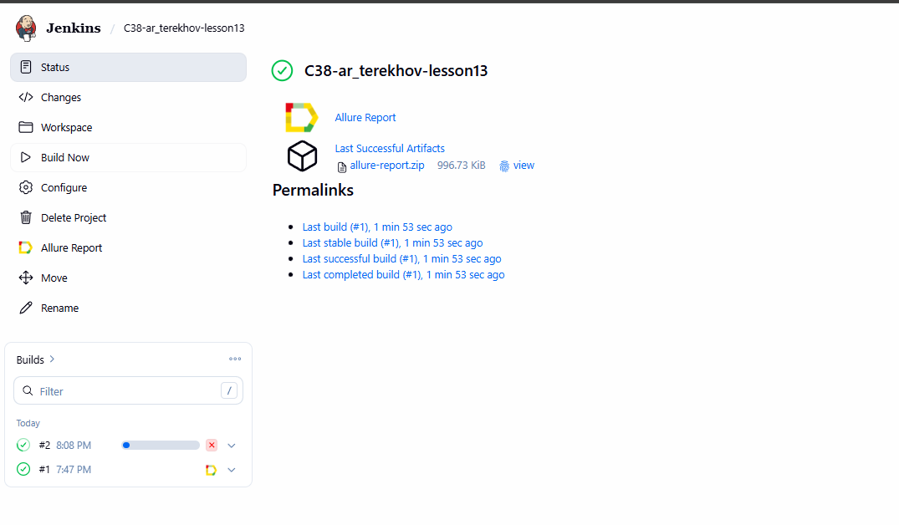
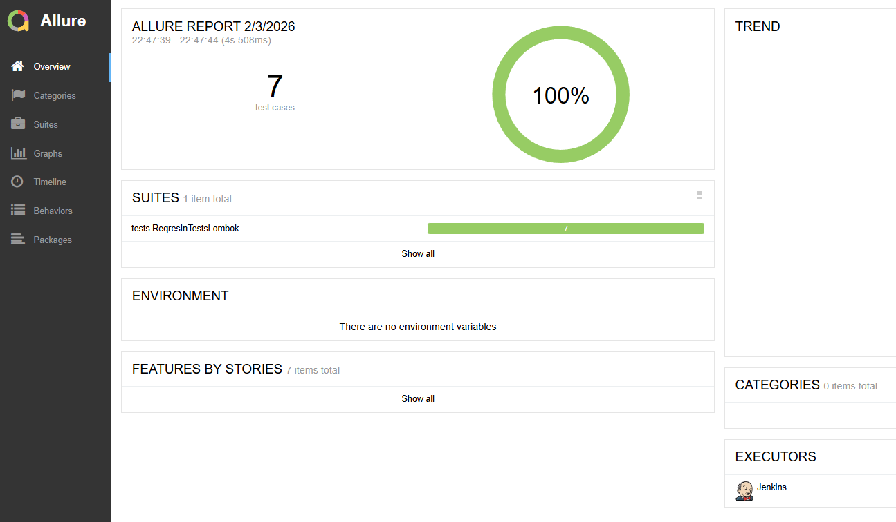
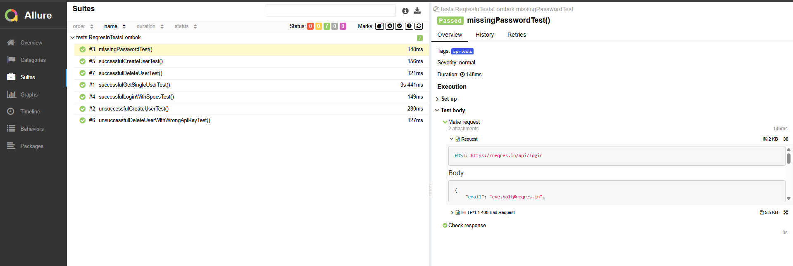

# Проект автоматизации [проекта ReqRes](https://reqres.in/)

> A real backend you can call directly.
Auth, data, and logs - ready for tests, demos, and frontend-led apps. Use it from Postman, Playwright, or fetch()..

## **Содержание:**
____

* <a href="#tools">Используемые технологии</a>

* <a href="#jenkins">Сборка Jenkins</a>

* <a href="#console">Запуск проекта</a>

* <a href="#allure">Allure report</a>

____

<a id="tools"></a>
## <a name="Используемые технологии">**Используемые технологии:**</a>

<p align="center">  
<a href="https://www.jetbrains.com/idea/"></a>  
<a href="https://www.java.com/"></a>  
<a href="https://junit.org/junit5/"></a>  
<a href="https://gradle.org/"></a>  
<a href="https://allurereport.org/"></a> 
<a href="https://www.jenkins.io/"></a>

</p>

____
<a id="jenkins"></a>
## </a><a name="Build"></a>Сборка в [Jenkins](https://jenkins.autotests.cloud/job/C38-ar_terekhov-lesson13/)</a>
____
<p align="center">  
<a href="https://jenkins.autotests.cloud/job/C38-ar_terekhov-bft_company/"></a>  
</p>


### **Параметры сборки в Jenkins:**

- *browser (browser, default chrome)*
- *browserVersion (browser version, default 208.0)*
- *browserSize (browser window size, default 1920x1080)*
___
<a id="console"></a>
## Команды для запуска через терминал  
***Локальный запуск:***
```bash  
gradle clean api-tests
```
___
<a id="allure"></a>
## </a> <a name="Allure"></a>Allure [report](https://jenkins.autotests.cloud/job/C38-ar_terekhov-bft_company/6/allure/)</a>
___

### *Main report page*

<p align="center">  </p>

### *Suite*

<p align="center">  </p>

___
